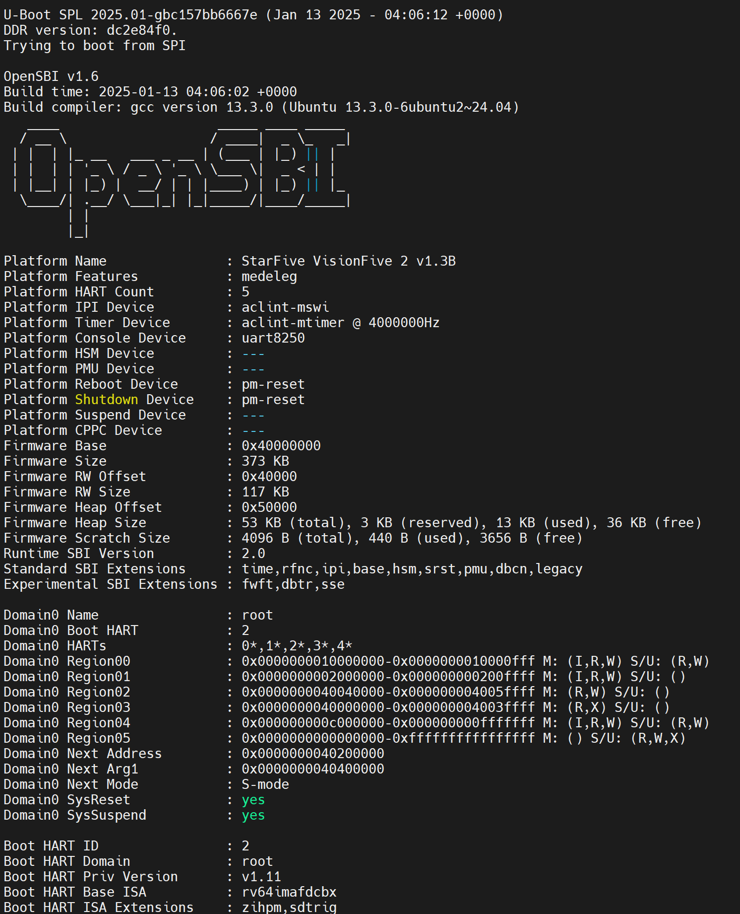

# VisionFive 2 Firmware CI

Automatically build the latest OpenSBI and U-Boot for VisionFive 2.

The binaries could be downloaded from the release page. 

There are two files in the release page, `u-boot-spl.bin.normal.out` and `u-boot.itb`, which work as `u-boot-spl.bin.normal.out` and `visionfive2_fw_payload.img` in the official guide, respectively.

They _work on my machine_, so they should work anywhere else.

See the official guide about how to flash the firmware.
- https://doc-en.rvspace.org/VisionFive2/Quick_Start_Guide/VisionFive2_SDK_QSG/recovering_bootloader%20-%20vf2.html
- https://doc-en.rvspace.org/VisionFive2/Quick_Start_Guide/VisionFive2_SDK_QSG/spl_new.html#updating_spl_and_u_boot-vf2__section_zpj_cqt_yvb